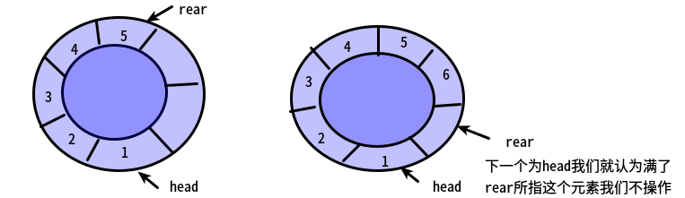

# 数据结构与算法笔记

#### 基本概念
##### 什么是数据?
数据是计算机加工处理的原料
##### 数据元素
一个有意义的个体,由一系列数据构成,通过这个数据完整描述一个个体
##### 数据对象
数据元素的集合,例如一群人就是一个数据对象,这个对象中有一个个的人,这些个体作为数据元素组成一个数据对象
##### 数据类型
由两部分组成
1. 数据内容本身
2. 对数据所进行的操作
> 数据类型是数据对象以及对其进行的一系列操作组成的,即便是数据相同,但是所做的操作不同,数据类型也不一样
##### 数据结构三要素
1. 逻辑结构
    描述数据元素之间的关系
2. 存储结构
    使用实际的编程语言实现所描述的逻辑结构
3. 运算方式(同样包括设计与实现)

### 线性表
#### 特征
1. 有序的序列
2. 一对一的关系
3. 数据元素是有限的
> 没有数据元素的线性表是空表
#### 概念
* 线性表数据元素是一个集合,集合元素拥有相同的类型
* 集合中前一个元素称之为前驱,当前元素后一个元素称之为后继
* 显而易见的,第一个元素没有前驱,最后一个元素没有后继
* 数据元素之间是一一对应的关系
* 存储地址连续

### 单链表

一个节点只包含下一个节点的指针
链表从头指针开始一直指向下一个节点,最后一个节点指向NULL,即空指针

> 链表的结点由**数据域**和**指针域**构成
> * 我们在定义链表时,会习惯性的定义一个头节点,以便统一链表节点的插入和删除操
> * **头节点** 也称之为**首元**节点,最后一个节点称之为**尾元**节点
> * 一般,链表实际从指数1开始算起
>

链表同样包括初始化,插入,删除,获取指定元素等操作

#### 顺序表与单链表的对比

| 数据结构 | 顺序表 | 单链表 |
|---|---|---|
| 存储结构 | 使用连续的内存空间进行存储 | 采用链式结构,使用任意存储单元存储线性表元素 |
| 时间性能 | 查找| 直接通过索引查找,效率较高 | 需要从头遍历单向链表,较慢|
|| 插入和删除| 需要频繁移动数组元素的位置,效率较低 | 通过链表指针进行增删,效率较高 |
| 空间性能 | 需要预先规划空间,大了浪费,小了不够用 | 可以灵活使用内存空间,按需使用,元素个数不受限制 |

### 循环链表(单向)
循环链表与单向链表的主要区别在于其最后一个节点是指向第一个节点的, 这样形成了一个闭圈,同时在对循环链表进行增删查的时候,需要注意对第一个节点进行特殊处理,因为第一个节点有两个指针指向该节点,同时由于其闭圈的特性,在遍历的时候可以采用`while`循环

### 双向链表
双向链表包括一个数据域和两个指针域,分别指向前驱和后继

#### 几种链表的比较
| 链表结构 | 优点 | 缺点 |
|---|---|---|
| 单链表 | 在找出结点之后,插入和删除的开销较低,不需要预分配空间 | 查找速度慢 |
| 循环链表 | 改进的闭环链表,可以从任意位置遍历链表 | 没有解决查找速度慢的问题 |
| 双向链表 | 优化查找速度,可以反向遍历,平均查找速度提高了一倍 | 需要记录前缀节点,增加了程序复杂度,占用了更多空间 |
| 静态链表 | 再插入和删除元素时,只移动游标,改进了顺序表在增删时需要移动元素的缺点 | 1. 没有解决顺序表长度固定的问题 2. 失去了顺序表随机存储的特性 |

### 静态链表
静态链表实际上是使用数组来模拟链表的特征,从而兼具两者的优点的一种数据结构.

具体而言就是:
1. 初始化一个足够大小的结构数组,其中结构主要由三部分组成:
    * 数组下标
    * 实际数据
    * 游标(相当于链表指向下一节点的指针)
2. 这个结构数组的第一个和最后一个元素用来存储静态链表的信息,不存储实际数据:
    * 第一个数组元素游标表示的是数组中第一个空置位的下标,初始为1
    * 最后一个数组元素的游标表示数组中第一个插入元素的下标,若静态数组为空,则游标值为0,这样一来,最后一个元素就可以看作是**静态链表数据域的头节点**
3. 静态链表中未使用的元素组成一个备用链表,这是一个抽象出来的链表,如前所述,可以把数组第一个元素视为**备用链表的头节点**
4. 静态链表中,存储数据的最后一个元素的游标为0,表示其作为实际存储数据的最后一个节点,这一点和最后一个数组元素游标为0的概念是不一样的.

> 数据域链表中游标为0表示该元素是数据域最后一个节点
> 数组中最后一个元素游标为0表示该静态链表实际长度为0,即没有插入过数据

#### 静态链表的删除操作
主要分三步:
1. 通过数据域头节点(最后节点的游标)进行遍历,找到待删除节点的前一个节点
2. 将前节点的游标设置为待删除节点的游标,则待删除游标此时被排除在数据与之外
3. 通过待删除节点的下标:
      * 将备用链表的头节点游标赋值给待删除节点的游标
      * 将备用链表头节点游标设置为待删除节点下标

    经以上步骤,则待删除节点被设置为备用链表第一个节点,**该方式并没有真正释放待删除节点中存放的数据(*链表中数据并不是使用malloc分配的内存*),这些数据会在之后的插入节点时被覆盖**

### 栈和队列
栈是仅允许在表尾增加和删除的一种线性表

>允许插入和删除的一端称之为**栈顶**,另一端称之为**栈底**
> 不含任何元素的栈称之为空栈

#### 栈与链栈

栈就是一个后进先出的线性表,单数使用线性表的缺点在于,栈的大小是事先设置的,无法灵活改变大小,为了改变这个状况,使用**链栈**这种使用链表来实现栈的数据结构,这与使用线性表实现栈最大的区别在于:
* 每次加入栈需要使用malloc分配空间
* 链栈是根据实际大小加入或者弹出栈元素,空间使用灵活
* 使用指针而不是数组下标维护栈元素

#### 队列

队列是一种从头部删除,尾部加入的线性表,这种增删结构导致一个现象:**假溢出**:

> 假溢出是指使用线性表实现队列的时候,虽然数组中还有空间,但是队列尾部已经到达数组边界,由于数据只能从尾部加入,所以此时无法再添加元素
> (产生假溢出是因为队列头部在删除元素的时候会向数组中部移动,导致队列头出现空隙)  

为了解决"假溢出"的问题,我们使用循环队列这个抽象出来的概念,即将队列想象成一个头尾相接的圆圈,这个队列能容纳的元素数量为MAX_SIZE,首部下标为front,尾部下标为rear

1. 初始化队列时,我们将tear和front置为0
2. 每当队列加入元素,则尾下标变为`(rear + 1) % MAX_SIZE`
3. 每当队列减少,则头下标变为`(front + 1) % MAX_SIZE`

> 两者增加的值都是当前值加1再模MAX_SIZE,这里取模的原因就是让首尾下标都不会越界,形成一种环状的错觉

由于首尾下标都是以一种循环的方式赋值,所以不会出现"假溢出"的情况
同时,判断循环队列为空,只需判断`rear == front`即可
判断循环队列已满,只需判断`(rear + 1) % MAX_SIZE == front`即可(实际上就是尾下标位于头下标前面)

> * 如果循环队列首尾下标初始化为0,那么每次尾部增加之后下标位置实际上是一个空位,这个空位实际上被浪费了,一直都没有使用
> * 又或者可以将首尾下标都初始化为-1,这时就不会浪费空间了,但是在增加第一个元素的时候,需要做特殊处理,反而更麻烦,而且-1这个下标是不直观的,索性就浪费一个空间,降低代码的复杂度
> * 循环队列的实际存储的最大数据值为`MAX_SIZE - 1`

***注意: 循环队列的头下标不一定会小于尾下标***,这是因为在动态增删的情况下,尾下标很可能会越过数组最大下标

